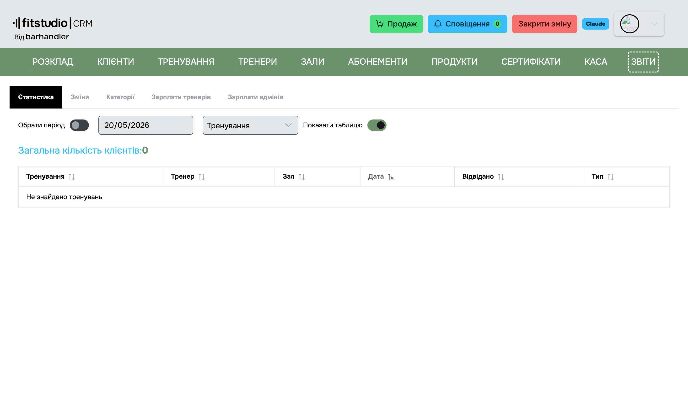
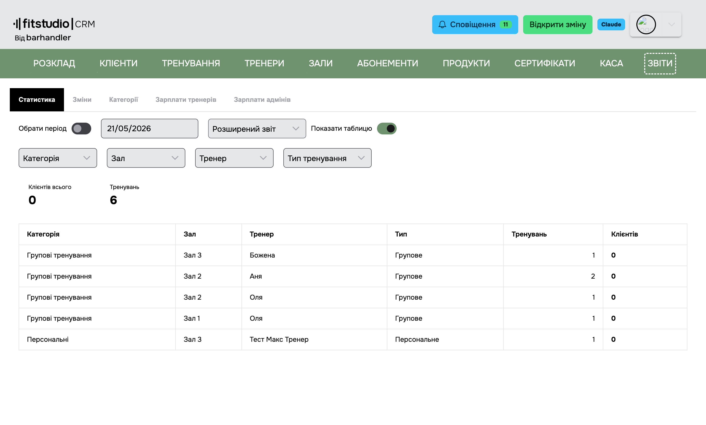
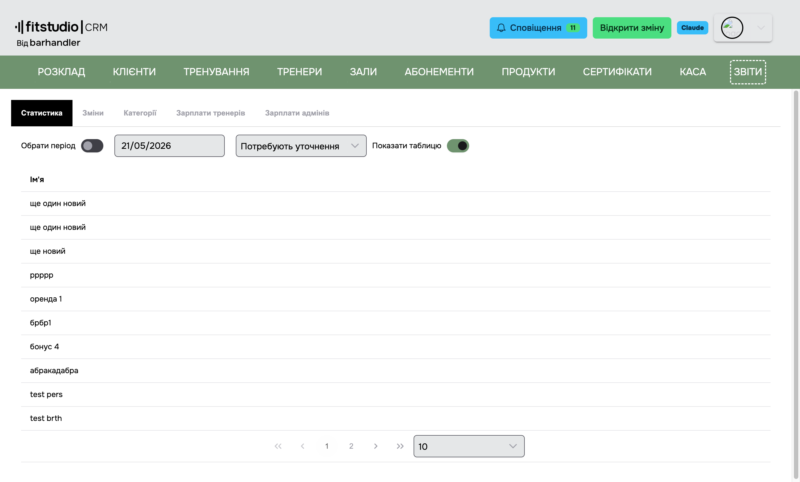
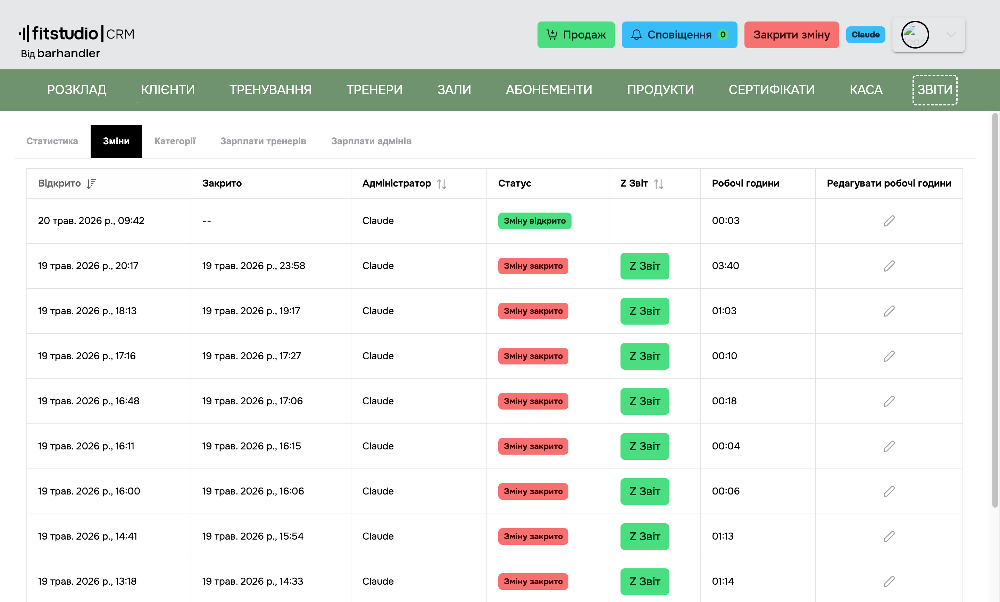
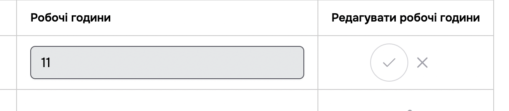
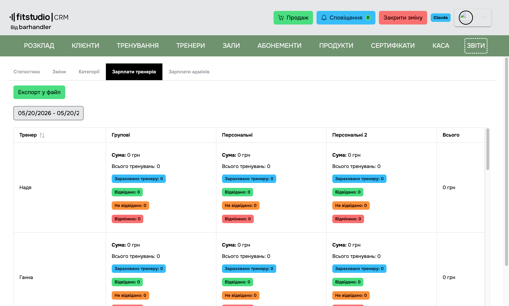
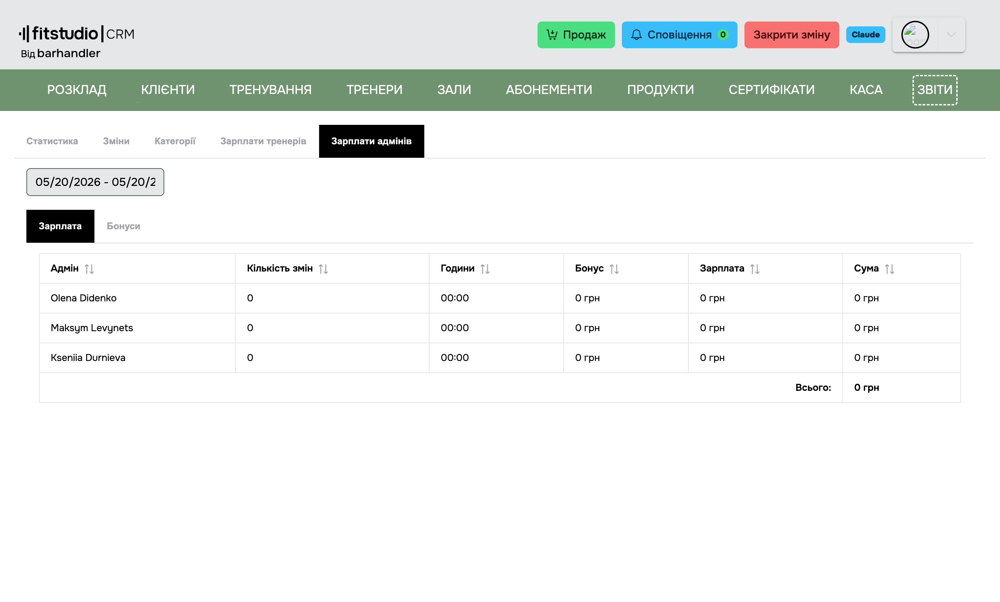

<a href="javascript:void(0)" onclick="history.back()">⬅️ Back</a>

[Back to home](/en/)

# 3.8 Reports

> The **Reports** page contains the following tabs:

- [Statistics](#_3-8-1-statistics)
- [Shifts](#_3-8-2-shifts)
- [Coach payroll](#_3-8-4-coach-payroll)
- [Administrator payroll](#_3-8-5-administrator-payroll)
- [Rating](#_3-8-6-rating)

> ℹ️ **Categories** ("Категорії") has moved from Reports to [Settings → Categories](/en/login/settings#categories).

> ℹ️ **Transactions** ("Транзакції") and the **Extended report** ("Розширений Звіт") have moved to the [Point of sale](/en/menu/pos) page, together with the fiscal reports and cash management.

---

## 3.8.1 Statistics

> A general-purpose report with several breakdowns. Above the table:

- **Date range** — the reporting period (the current month by default).
- **Report type** ("Тип звіту") — a drop-down list:
  - **Classes** ("Тренування") — every class held, in detail (Name, Coach, Room, Date, Attended, Type).
  - **Memberships** ("Абонементи") — membership sales and usage.
  - **Products** ("Продукти") — product sales.
  - **Clients** ("Клієнти") — per-client statistics (Name, Total classes, Attended, Cancelled, No-shows, Date of the last visit, activity in the client app).
  - **Extended report** ("Розширений звіт") — a report on classes held, with filters:
    - **Category** ("Категорія") — limit to one category.
    - **Room** ("Зал") — limit to one room.
    - **Coach** ("Тренер") — limit to one coach.
    - **Class type** ("Тип тренування") — Group / Personal / Rent.

    Columns: **Category**, **Room**, **Coach**, **Type**, **Classes** (the number of classes in the grouped period), **Clients** (the total number of attendances). Rows with zero values are excluded automatically. Above the table there is a **Classes** / **Total clients** summary.

    

  - **Need clarification** ("Потребують уточнення") — the list of clients whose **phone number is empty** in the [client card](/en/menu/clients#_3-2-6-editing-a-client). Other fields (email, date of birth) are not taken into account here. This is useful for keeping the database clean, because without a phone number a client will not receive push notifications from the client app.

    

- **Chart** ("Графік") — a button that switches between the table and the visualisation, where one applies.

---

## 3.8.2 Shifts

> The list of all shifts within the selected period.

**Columns:**

- **Opened** ("Відкрито") — the date and time the shift was opened.
- **Closed** ("Закрито") — the date and time the shift was closed.
- **Administrator** ("Адміністратор") — the administrator's name.
- **Status** ("Статус") — Shift opened ("Зміну відкрито") / Shift closed ("Зміну закрито").
- **Z-report** ("Z звіт") — a button that opens the fiscal Z-report for the shift.
- **Working hours** ("Робочі години") — the number of hours used for the payroll calculation.
- **Editing working hours** — an administrator may edit the hours of **their own closed shifts only**.

Pressing **Edit** ("Редагувати") turns the **Working hours** field into an input, and **Save** ("Зберегти") / **Cancel** ("Відмінити") buttons appear in the **Actions** column.

> 💡 To enter a fractional value (1 hour 48 minutes), convert it to minutes and divide by 60: 108 ÷ 60 = **1.8 hours**.

---

## 3.8.4 Coach payroll

> The coaches' payroll for the selected period.

**Columns:**

- **Coach** ("Тренер") — the coach's name.
- **Dynamic columns** — the system groups every class in the period by **category**, and each category becomes its own column. The value and the calculation type come **from the class category** ([Categories](/en/login/settings#categories)):
  - **Per person** (`PerPerson`) — `total number of clients × baseRate`.
  - **Per class** (`PerWorkout`) — `number of classes held × baseRate`.
- **Total** ("Всього") — the sum of all categories for that coach.

> The bottom row of the table shows the **total across all coaches**.

**Export:** a button exports the payroll to a **TXT file** (a text report broken down by coach and category). No other export formats are available.

> ℹ️ The calculation respects the **"Take the maximum number of people into account when calculating payroll"** setting ([3.8.4.1](#_3-8-4-1-payroll-settings)) — if a class has more clients than `workoutCapacity`, only `workoutCapacity` is counted.

### 3.8.4.1 Payroll settings

For details see [Settings → Features](/en/login/settings#features). The parameters that affect the calculation are:

- **Minimum number of clients** — if there are fewer clients, the coach is credited with the minimum.
- **Take the maximum number of people into account** — caps the calculation at the class capacity.
- **Remove a recurring booking after N misses** — affects the clients' history within the period.

---

## 3.8.5 Administrator payroll

**Columns:**

- **Administrator** ("Адміністратор")
- **Number of shifts** ("Кількість змін") — how many working shifts they opened during the period.
- **Hours** ("Години") — the total hours worked, taken from the [Shifts](#_3-8-2-shifts) table.
- **Bonus** ("Бонус") — credited if administrator bonuses are configured in [Settings](/en/login/settings).
- **Salary** ("Зарплата") — `hours × the hourly rate from the administrator's profile`, without the bonus.
- **Total** ("Сума") — `Salary + Bonus`.

> Bonuses are configured in [Settings → Features → Administrator bonuses](/en/login/settings#features).

---

## 3.8.6 Rating

> The ratings clients leave through the client app.

- The studio's overall average rating and the number of ratings.
- The rating of each coach separately.
- The list of reviews with their text and date. The **Super Admin** ("Супер Адмін") and **Admin** ("Адмін") roles may delete a review.

> ℹ️ Stars become public only once there are enough ratings for the average to mean anything. Until then clients do not see the rating at all.

---

<a href="javascript:void(0)" onclick="history.back()">⬅️ Back</a>

[Back to home](/en/)
