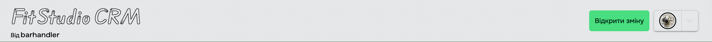
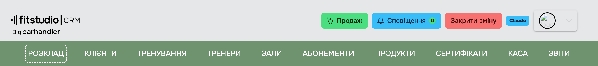
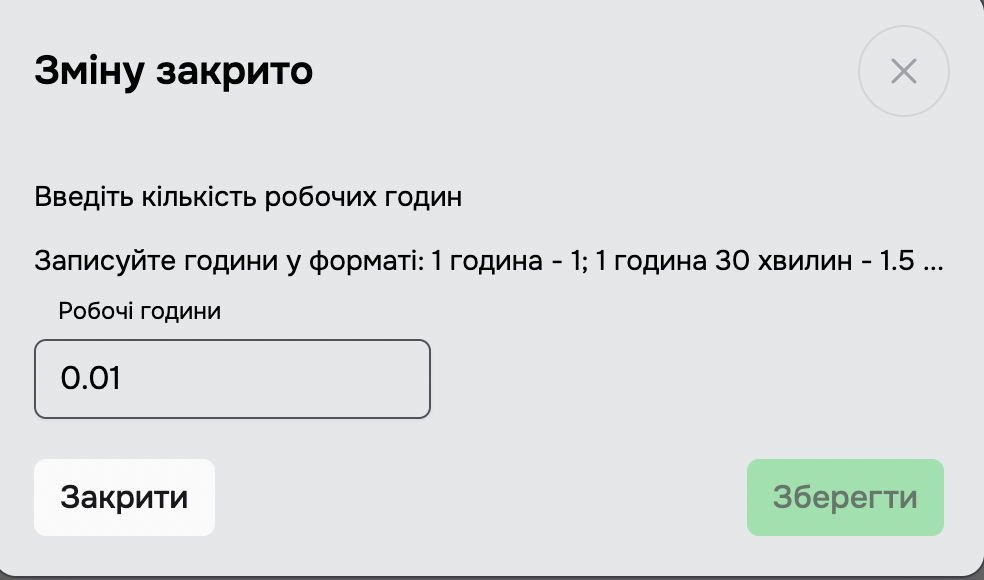
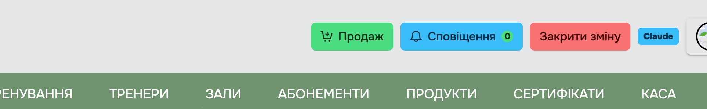
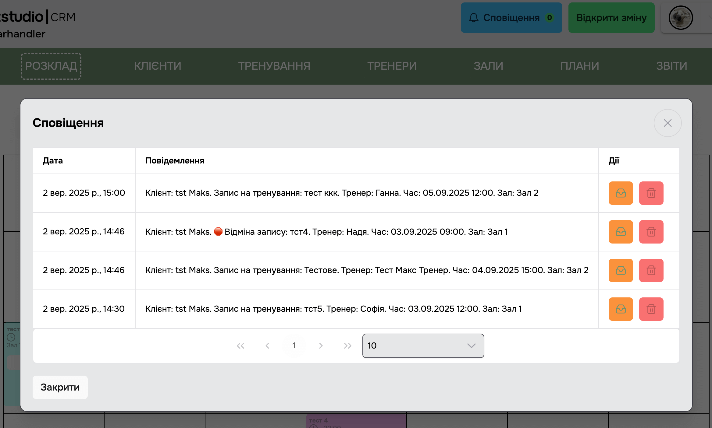

[Back to home](/en/)

# 2. Opening and Closing a Shift

## 2.1 Opening a Shift

> The **Open Shift** button is located on the right side of the header when the shift is closed.

**Restrictions while the shift is closed:**

- The **Sale** button is hidden (available only when the shift is open).
- Scanning cards and certificate QR codes is blocked — the system shows the "You need to open a shift!" modal.
- When a user with the Admin role tries to open the **Clients** tab, a warning appears: "You have not opened the current shift. Some actions will not be available" (you can proceed, but some actions will be restricted). **SuperAdmin** and **Manager** work with the tab without restrictions.

> Shifts are used to calculate working time and [administrator salaries](/en/menu/reports#_3-8-5-administrator-payroll).

> If PRRO (fiscalization) is connected, opening/closing a shift is synchronized with VchasnoKasa (the server calls the corresponding `OpenShift` / `CloseShift` command).

---

## 2.2 Closing a Shift

> The **Close Shift** button is located on the right side of the header when the shift is open.

> After clicking the **Close Shift** button, the ["Are you sure you want to continue?" modal window](../_modals/are-you-sure-modal.md ":include") will be shown. If you continue, the **Shift Closed** modal window will appear.

> In this window, you can edit the working hours. Follow the instructions shown in the modal window.

> You can change the working hours of your shift later in the **Reports** section.

---

## 2.3 Notifications

> Notifications are collected for events in the studio: bookings/cancellations by clients through the mobile app, automatic system reminders (e.g. *"Client X was automatically removed from the recurring booking: N workouts missed"* — see [Settings → Features → Remove Recurring Booking](/en/login/settings#features)), PRRO confirmation notifications, and more.
> The counter on the button shows the number of unread notifications.

> Clicking it opens a modal window with a list: date, message text, actions. Each notification can be marked as read / unread or deleted.

---

## Checking the fiscal integrations when opening and closing

Pressing **Open shift** ("Відкрити зміну") or **Close shift** ("Закрити зміну") opens a window listing the active fiscal cards: for each one it shows whether there is a connection, and what state the shift is in on the Vchasno or Checkbox side.

If the state here and the state at the fiscal operator have drifted apart — the shift is already closed there but not here, say — a **Synchronise** ("Синхронізувати") button appears and brings the two into line.

---

## Automatic Shift Closing

If automatic closing is enabled in the studio settings, an open shift closes itself automatically every day at 23:58. An entry "Shift closed automatically" will appear in the notifications section.

[Back to home](/en/)
