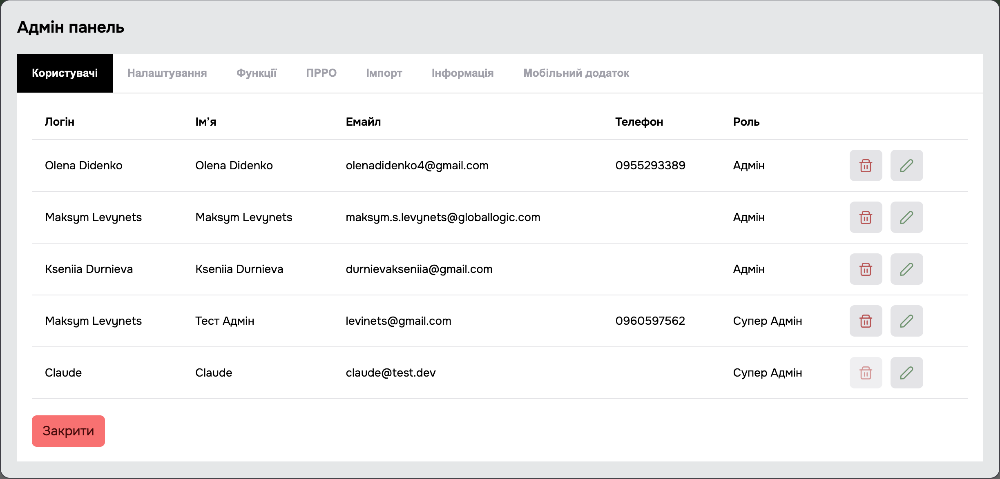
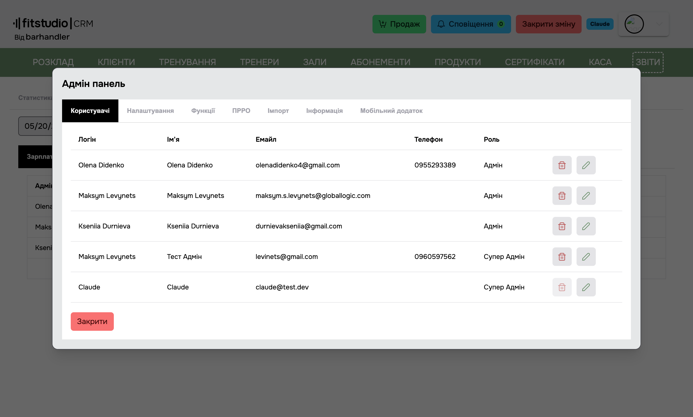
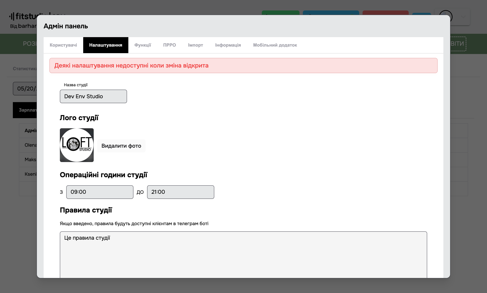
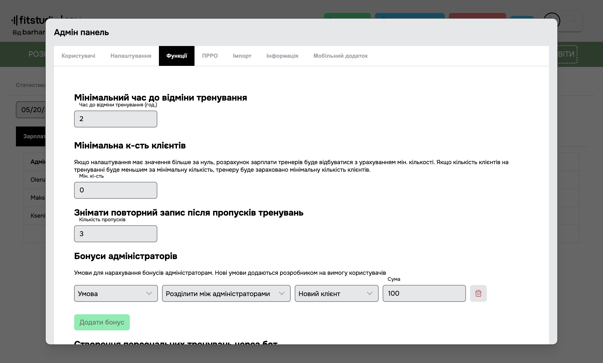
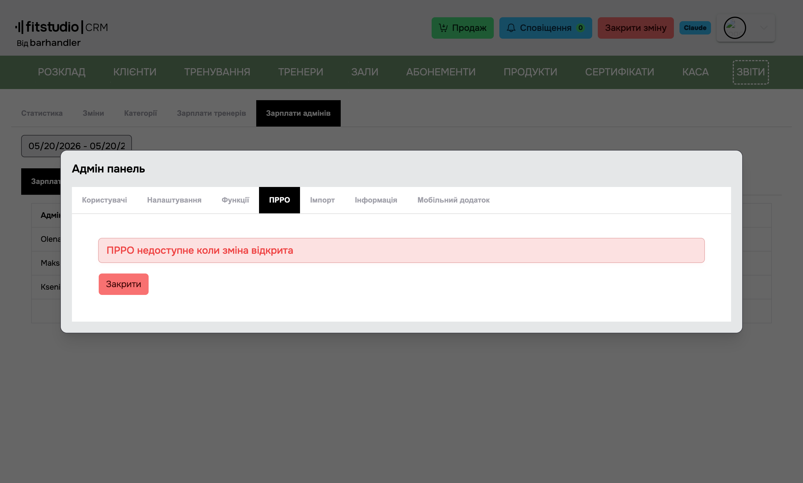
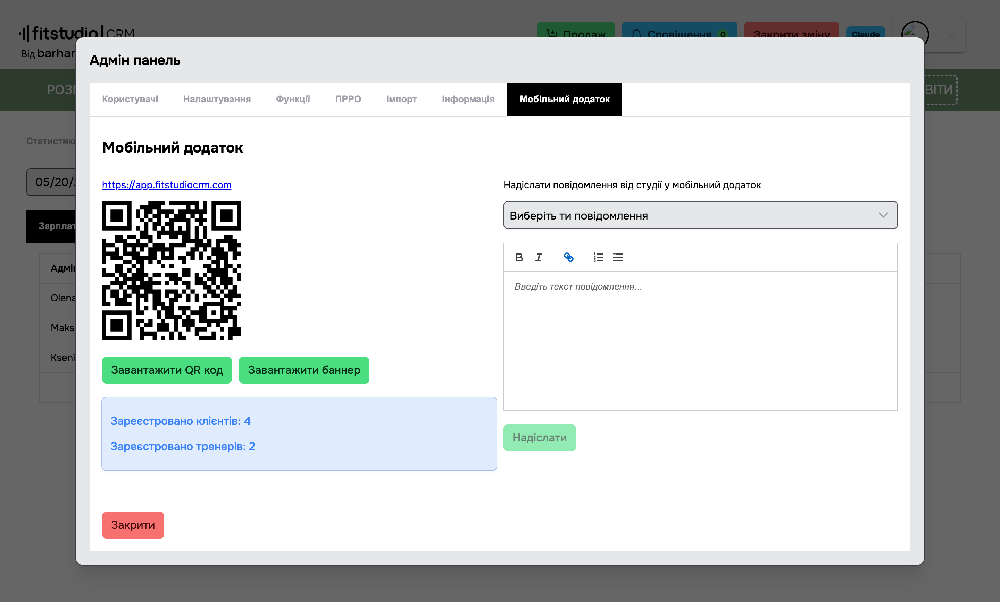

<a href="javascript:void(0)" onclick="history.back()">⬅️ Назад</a>

[Повернутися на головну](/)

# 1.3.2.2 Налаштування

> Розділ **Налаштування** — це адмін-панель студії, розбита на вкладки. Доступ — тільки **SuperAdmin**.

**Вкладки:**

- [1. Користувачі](#користувачі) — керування акаунтами адмінів.
- [2. Налаштування](#налаштування) — загальні параметри студії (лого, години, часовий пояс, правила).
- [3. Функції](#функції) — фічі і бізнес-правила (відміни, бонуси, бот, нагадування).
- [4. ПРРО](#прро) — фіскальна інтеграція (ВчасноКаса).
- [5. Імпорт](#імпорт) — імпорт клієнтів з Excel.
- [6. Інформація](#інформація) — версія та допоміжна інформація.
- [7. Мобільний додаток](#мобільний-додаток) — налаштування PWA.
- [8. Категорії](#категорії) — категорії для розрахунку зарплати тренерів (перенесено зі Звітів).

---

## Користувачі

> Список адмінів студії, додавання нових, редагування ролей, видалення.

**Колонки таблиці:**

- **Імʼя**, **Email**, **Телефон**, **Роль** (SuperAdmin / Admin / Manager), **Погодинна ставка** (для розрахунку зарплати).
- **Дії**: Редагувати, Видалити.

**Додавання користувача** — кнопка **+ Додати користувача** відкриває модалку з полями: Імʼя, Email, Телефон, Роль, Погодинна ставка.

---

## Налаштування

> Загальні параметри студії.

### Назва студії

Текстове поле. Використовується у телеграм-боті та фіскальних чеках.

### Лого студії

> Завантаження або заміна логотипу. Підтримує JPG/PNG. Кнопка **Видалити фото** прибирає поточне лого.

### Операційні години студії

> Час початку і кінця робочого дня (вибір через time picker). Впливає на:

- Підказки у формі створення тренувань.
- Розрахунок зарплати адмінів (не може перевищувати тривалість зміни).
- Мобільний додаток (приховує бронювання поза цими годинами).

### Правила студії

> Текстове поле з підтримкою багаторядкового тексту. Відображається клієнтам у мобільному додатку (вкладка **Кабінет → Інформація → Правила**).

### Часовий пояс студії

> Випадаючий список з IANA-часовими поясами (за замовчуванням `Europe/Kyiv`). Впливає на ВСІ дати та звіти.

> ⚠️ Зміна часового поясу — операція з широким радіусом дії. Селект блокується якщо у студії є хоча б одне тренування — інакше дати у вже створених тренуваннях можуть «зсунутись». Спочатку треба видалити/обробити всі тренування, потім міняти TZ.

---

## Функції

> Бізнес-правила і фіча-флаги. Кожна група винесена у власну секцію з заголовком.

### Мінімальний час до відміни тренування

- **Час до відміни тренування (год)** — число (за замовчуванням 6).
- Якщо клієнт має активний абонемент і скасовує тренування **менше ніж за вказану кількість годин** до початку — тренування **списується** з абонементу як **Не відвідано**.

### Мінімальна кількість клієнтів

- **Мін. к-сть** — число.
- Якщо налаштування > 0 і на тренуванні було менше клієнтів — тренеру зараховується мінімум (захист від невигідних малих груп).
- Доступно тільки для типу ставки **"Кількість людей на тренуванні"** (`PerPerson`).

### Знімати повторний запис після пропусків тренувань

- **Кількість пропусків** — число.
- Якщо клієнт має дублюючий запис на тренування і пропускає N послідовних занять (статус **Не відвідано**) — система автоматично знімає його з повторного запису.
- `0` або порожнє поле → вимикає функцію.

### Бонуси адміністраторів

> Налаштування бонусів, що нараховуються у звіті [Зарплати адмінів](/menu/reports#_385-Зарплати-адмінів).

Кожен бонус — рядок з трьох полів:

- **Умова** — за що нараховується (наприклад, "Кожна продана картка", "Кожна закрита зміна").
- **Нарахування** — спосіб (фіксована сума / відсоток).
- **Тип клієнта** — фільтр (новий клієнт / усі).

Кнопки **➕ Додати бонус** і **🗑 Видалити** (іконка кошика) для кожного рядка.

### Створення персональних тренувань через бот

- **Тогл "Дозволити тренерам створювати персональні тренування через бот"** — вмикає функціонал.
- Якщо увімкнено, зʼявляється список **категорій**, для яких бот дозволяє створювати тренування. Тренер може створити персональне тренування тільки в межах цих категорій.
- Кнопка **+ Додати категорію** додає рядок з випадаючим списком категорій студії.

### Нагадувати про дні народження тренерів

- **Днів** — за скільки днів до ДН прийде сповіщення.
- `0` → функція вимкнена.

### Функції (додаткові тогли)

- **Повідомляти клієнтам про заміну тренера (Додаток)** — якщо для тренування призначено заміну, всі записані клієнти отримають push у мобільному додатку.
- **Враховувати максимальну к-сть людей при підрахунку зарплат** — обмежує зараховану тренеру к-сть клієнтів значенням `workoutCapacity`.
- **Закривати зміну автоматично** (закриється о 23:57) — згідно з законодавством, зміна по касі не може тривати понад 24 години. Автозакриття уникає людського фактора і дотримує цю вимогу.
- **Нараховувати борг за неявку на персональне (без абонемента) та зараховувати тренеру** — коли увімкнено: якщо персональному тренуванню виставлено статус **«Не відвідано»**, а в клієнта **немає активного персонального абонемента**, система автоматично створює клієнту **борг** на суму вартості тренування (ціна привʼязаного до категорії абонемента) і **зараховує тренеру** це тренування у зарплату. Спрацьовує на будь-якому виставленні «Не відвідано» (нічний авто-процес, пізня відміна, ручне виставлення адміном). Якщо в категорії тренування немає привʼязаного абонемента з ціною — борг не створюється.

---

## ПРРО

> Інтеграція з фіскальним реєстратором розрахункових операцій. Наразі підтримується **ВчасноКаса**.

### Підключення

- **Додати ПРРО** (тогл) — вмикає інтеграцію. Зʼявляються поля нижче.
- **Заголовок чека** — текст у верхній частині чека _(необовʼязково)_.
- **Нижня частина чека** — текст у нижній частині чека _(необовʼязково)_.
- **Вчасно каса токен** — токен з кабінету ВчасноКаса.

### Що змінюється при увімкненому ПРРО

- Усі продажі (готівка/картка) **фіскалізуються** через ВчасноКаса; для кожної транзакції створюється фіскальний чек.
- При закритті зміни автоматично друкується Z-звіт.
- Поповнення особового рахунку також фіскалізується (як звичайна транзакція). Списання з особового рахунку — НЕ фіскалізується (бо гроші вже були зафіскалізовані при поповненні).

> ℹ️ Кнопки **X Звіт** і **Звіт за день** на сторінці [Каса](/menu/pos) доступні **коли відкрита зміна**, незалежно від інтеграції з ПРРО. Без ПРРО ці звіти показують підсумок руху коштів за зміну/день; з ПРРО — додатково містять фіскальні дані ВчасноКаса.

---

## Імпорт

> Імпорт клієнтів з Excel-файлу.

[Детальніше про імпорт](/pages/setup#_472-Імпорт-клієнтів-з-Excel-файлу)

---

## Інформація

> Технічна інформація.

- **Версія** — поточна версія додатку.
- Дата та джерело останнього оновлення.
- Контакти підтримки.

---

## Мобільний додаток

> Інструменти для роботи з мобільним PWA-клієнтом студії.

### Посилання + QR

- **Посилання на додаток** — URL встановлення PWA (за замовчуванням `https://app.fitstudiocrm.com`). Клікабельне, відкривається в новій вкладці.
- **Завантажити QR код** — кнопка завантажує PNG з QR-кодом, що веде на це посилання. Можна надрукувати і показати клієнту у студії.
- **Завантажити баннер** — готовий до друку рекламний банер з QR-кодом і логотипом додатку.

### Лічильники користувачів

Інформаційний блок з кількістю зареєстрованих у додатку:

- **Зареєстровано клієнтів: N** — скільки клієнтів студії підключило мобільний додаток.
- **Зареєстровано тренерів: N** — скільки тренерів студії має активний акаунт у додатку.

### Надіслати повідомлення від студії

> Розсилка push-повідомлення усім користувачам додатку обраної аудиторії.

- **Виберіть тип повідомлення** — випадаючий список:
  - **Клієнтам** — push отримають усі клієнти.
  - **Тренерам** — push отримають усі тренери.
  - **Усім** — обом аудиторіям.
- **Текстовий редактор** — підтримує форматування (жирний/курсив/посилання). Має ліміт довжини; при перевищенні зʼявляється помилка "Повідомлення пусте або занадто довге".
- **Надіслати** — кнопка стає активною після вибору аудиторії та введеного тексту. Натискання миттєво ставить повідомлення в чергу для доставки усім пристроям.

---

## Категорії

> Вкладка **Категорії** (раніше була у [Звітах](/menu/reports)). Категорії використовуються для розрахунку зарплати тренерів і опційно для звʼязки з абонементом.

**Таблиця колонки:**

| Колонка                     | Опис                                                                                                                                                           |
| --------------------------- | -------------------------------------------------------------------------------------------------------------------------------------------------------------- |
| **Назва**                   | Імʼя категорії (наприклад "Групові", "Персональні", "Дитячі").                                                                                                 |
| **Базова ставка категорії** | Сума у грн, що йде у формулу зарплати.                                                                                                                         |
| **Тип ставки**              | **За людину** (`PerPerson`) — рахується кількість клієнтів і множиться на ставку. **За тренування** (`PerWorkout`) — рахується кількість проведених тренувань. |
| **Абонемент**               | Опційний звʼязок з конкретним абонементом (для категорій під персональні плани).                                                                               |
| **Дії**                     | Редагувати / Видалити.                                                                                                                                         |

**Пошук** — поле над таблицею, шукає по назві.

### Додати / Редагувати категорію

> Кнопка **+ Додати категорію** відкриває модалку. Така ж модалка — при натисканні на **Редагувати** у рядку.

**Поля:**

- **Назва** — обовʼязкове.
- **Базова ставка** — обовʼязкове, число у грн.
- **Тип ставки** — **За людину** / **За тренування**.
- **Абонемент** — привʼязка категорії до конкретного абонементу. Поле **опційне для типу "За людину"**, але **обовʼязкове для типу "За тренування"** (позначене зірочкою у формі). Логіка: при PerWorkout зарплата за категорію залежить від конкретного плану клієнта; без абонементу неможливо однозначно порахувати.

> ℹ️ Якщо обрано **За тренування** без абонементу — кнопка **Зберегти** буде неактивна. Спершу створіть або оберіть відповідний абонемент.

---

<a href="javascript:void(0)" onclick="history.back()">⬅️ Назад</a>

[Повернутися на головну](/)
