<a href="javascript:void(0)" onclick="history.back()">⬅️ Назад</a>

[Повернутися на головну](/)

# 3.2 Клієнти

## 3.2.1 Таблиця клієнтів

> Таблиця клієнтів містить:

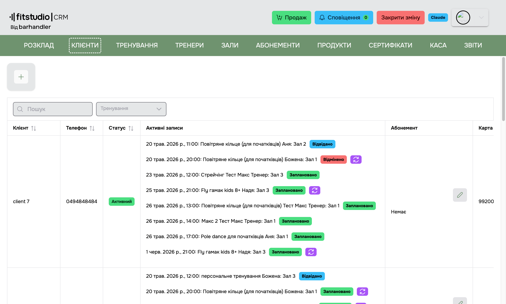

- **Імʼя**
- **Телефон**
- **Статус** (активний/неактивний)
- **Активні записи** — показуються у форматі:  
  `Дата, час, Назва тренування, Тренер, Зал — Статус`
- **Статус**:
  - **Заплановано** (зелений) — клієнт записаний на тренування
  - **Відвідано** (синій) — клієнта зареєстровано на тренування
  - **Відмінено** (червоний) — тренування відмінено або клієнт відмінив його завчасно
  - **Не відвідано** (помаранчевий) — клієнт не прийшов на тренування або відмінив його пізно
- **Абонемент** — відображається активний абонемент, а також кількість разових тренувань (якщо були придбані та не використані).  
  Якщо у клієнта є абонементи, доступна кнопка **Редагувати** (іконка олівця), яка відкриває сторінку [Редагування абонементів](#_324-Редагування-абонементів).

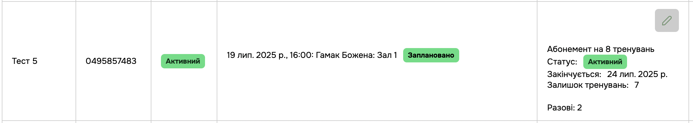

- **Карта** — номер картки клієнта
- **Дії** — доступні опції:
  - **[Історія](#_325-Історія)** 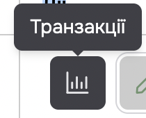
  - **[Редагувати](#_326-Редагування-клієнта)** 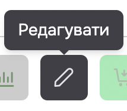
  - **[Продаж](#_327-Продаж)** 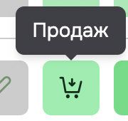
  - **[Запис](#_328-Запис)** 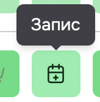
  - **[Реєстрація](#_329-Реєстрація)** 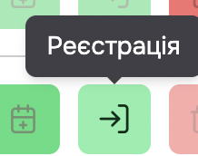
  - **[Видалити](#_3210-Видалення-клієнта)** 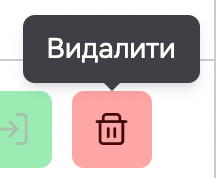

---

## 3.2.2 Створення клієнта

> Кнопка **Додати клієнта** знаходиться зверху з лівого боку.

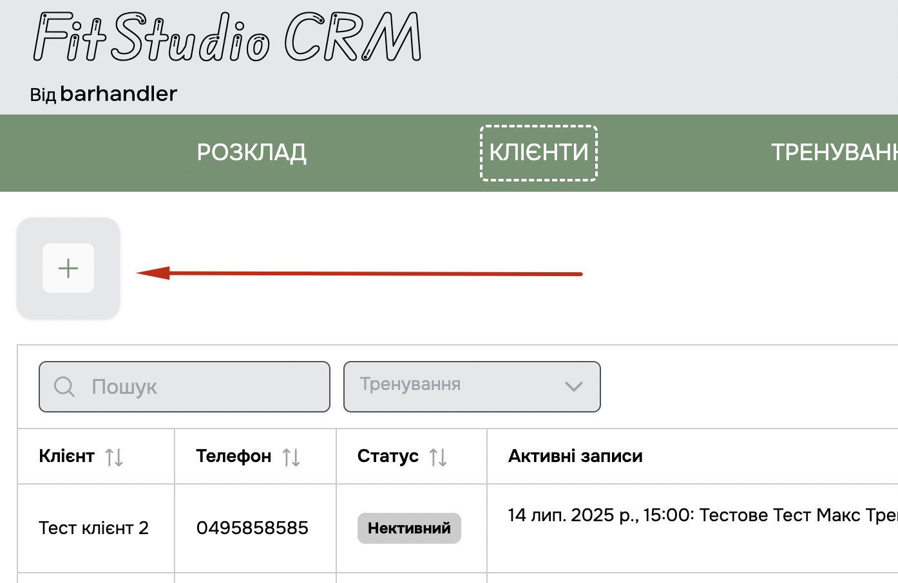

> Після натискання відкриється модальне вікно **Новий клієнт**:

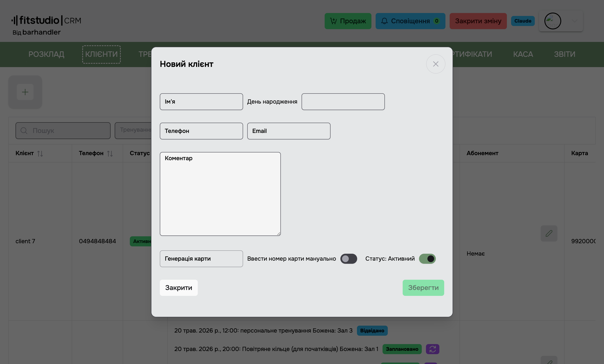

- Імʼя клієнта
- Дата народження
- Телефон
- Емейл
- Генерація картки та тогл **Ввести номер карти вручну** працюють разом:
  - Якщо тогл вимкнено — система автоматично згенерує електронну картку клієнта.
  - Якщо увімкнено — поле змінює назву на **Карта клієнта**, де можна ввести номер вручну або зісканувати його.

---

## 3.2.3 Сканування картки

> Скануйте картку клієнта за допомогою сканера (з картки, екрану телефону або з Мобільниого додатку).  
> Сканування працює на будь-якій сторінці, крім відкритого модального вікна створення або редагування клієнта.

- Якщо сканування успішне — відкривається модальне вікно **[Реєстрація](#_329-Реєстрація)**.
- Якщо дані не розпізнані — зʼявиться повідомлення:

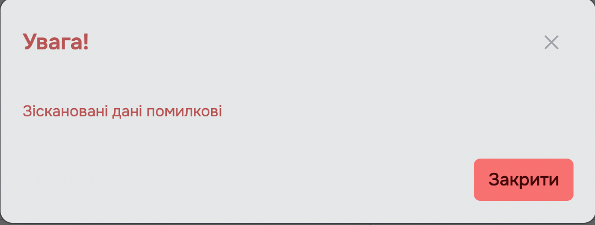

---

## 3.2.4 Редагування абонементів

> При натисканні на кнопку редагування абонементів відкривається модальне вікно:

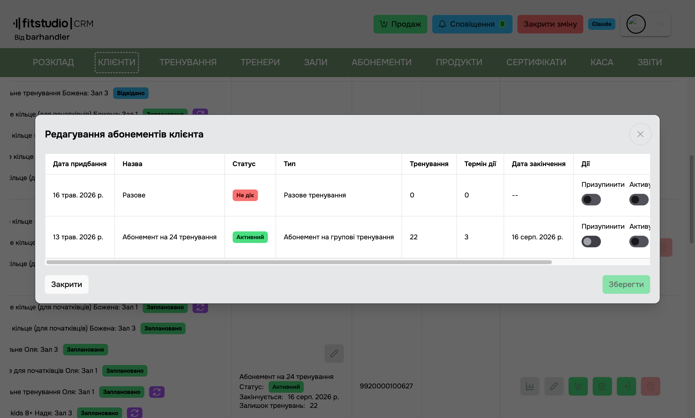

**Містить:**

- Дата придбання
- Назва
- Статус:
  - активний (зелений)
  - неактивний (сірий)
  - призупинено (помаранчевий)
  - не діє (червоний)
- Тип
- Тренування (залишок)
- Термін дії
- Дата закінчення
- Дії:
  - Призупинити (тільки для довгострокових абонементів)
  - Активувати (призупинений або неактивний абонемент)
- Редагування (можна змінити кількість тренувань та дату закінчення для активного абонементу)

> Після внесення змін кнопка **Зберегти** стане активною. Натискання збереже зміни та закриє вікно.

---

## 3.2.5 Історія

> При натисканні на кнопку **Історія** відкривається модальне вікно:

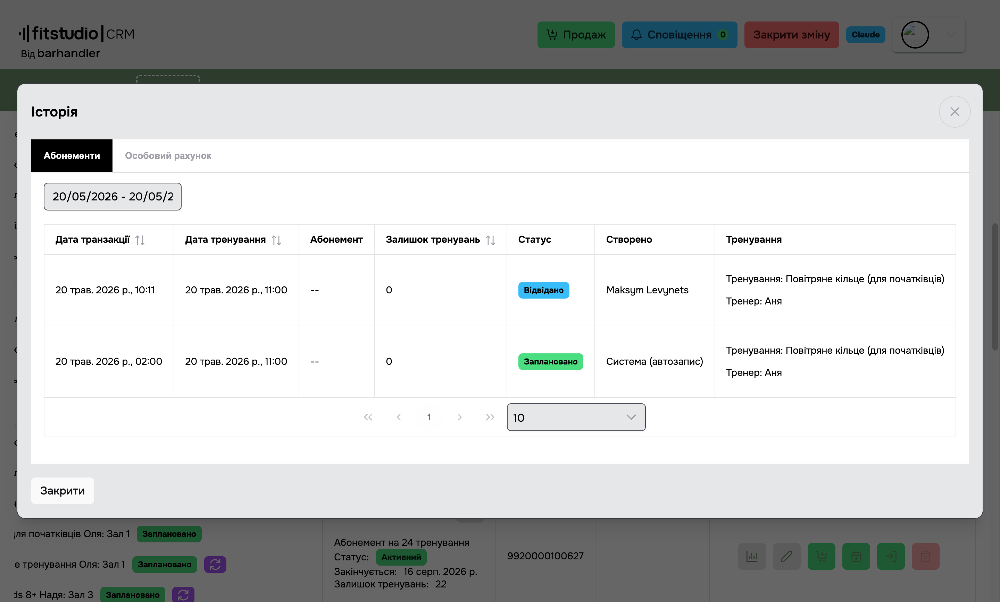

- Містить історію руху тренувань по абонементах та причину списання.
- Інтервал можна змінювати через date picker.

---

## 3.2.6 Редагування клієнта

> При натисканні на кнопку **Редагувати** відкривається вікно, аналогічне створенню клієнта, але всі поля заповнені.  
> Не редагується тільки поле **Карта клієнта**, якщо номер був згенерований автоматично.

---

## 3.2.7 Продаж

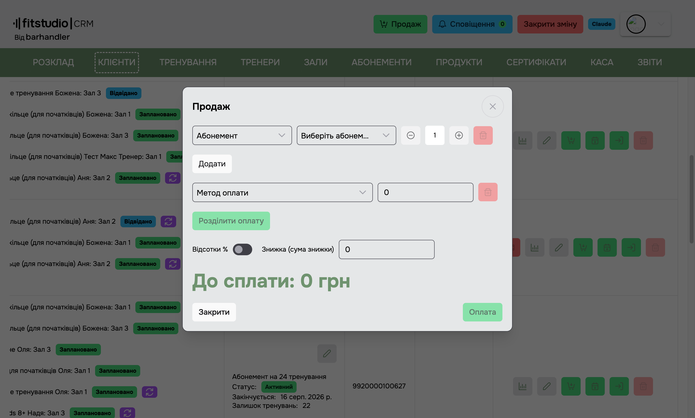

**Модальне вікно продажу містить:**

- Фільтр по типах абонементів
- Список доступних абонементів
- Метод оплати
- Контролер кількості
- Поле для знижки
- Суму до оплати

---

## 3.2.8 Запис

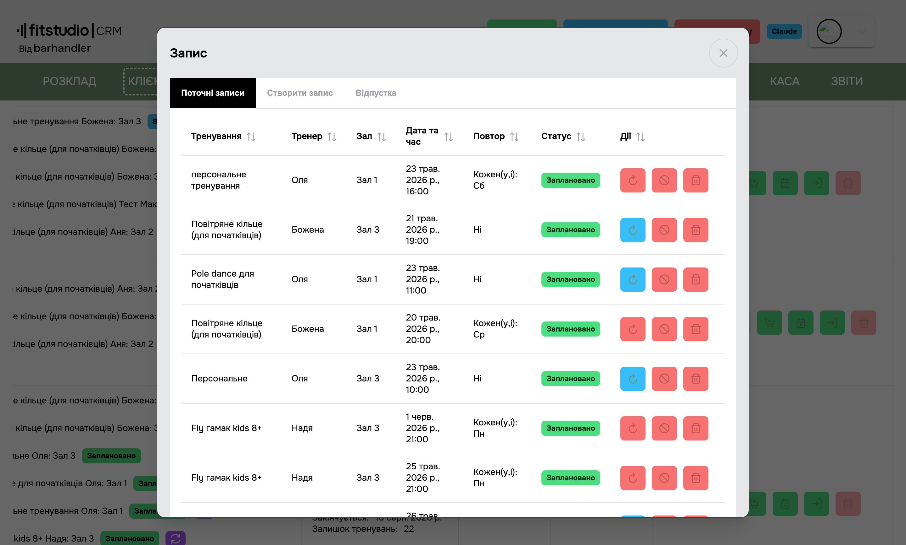

- У табі **Поточні записи** відображаються активні записи клієнта.
- Якщо тренування повторюється — можна відмінити лише найближче або всі повтори.
- Якщо тренування одноразове — доступна лише одна кнопка відміни.

**Таб "Створити запис":**

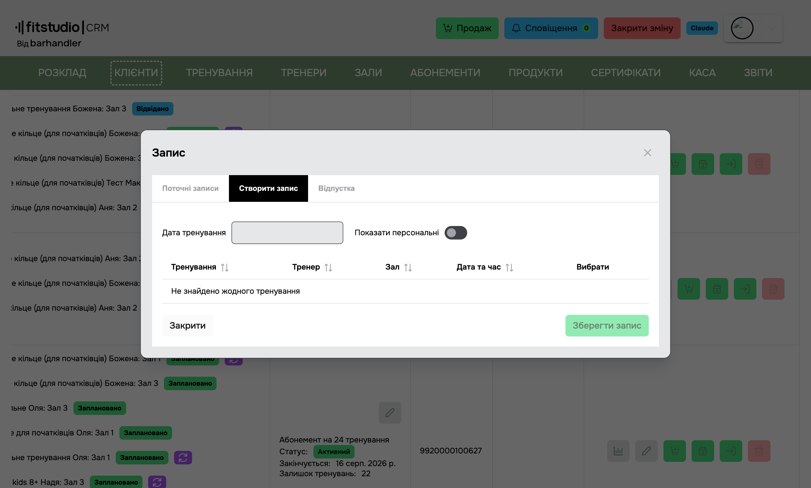

- Виберіть дату — зʼявиться список тренувань.
- Увімкніть тогл **Вибрати**, щоб додати тренування.

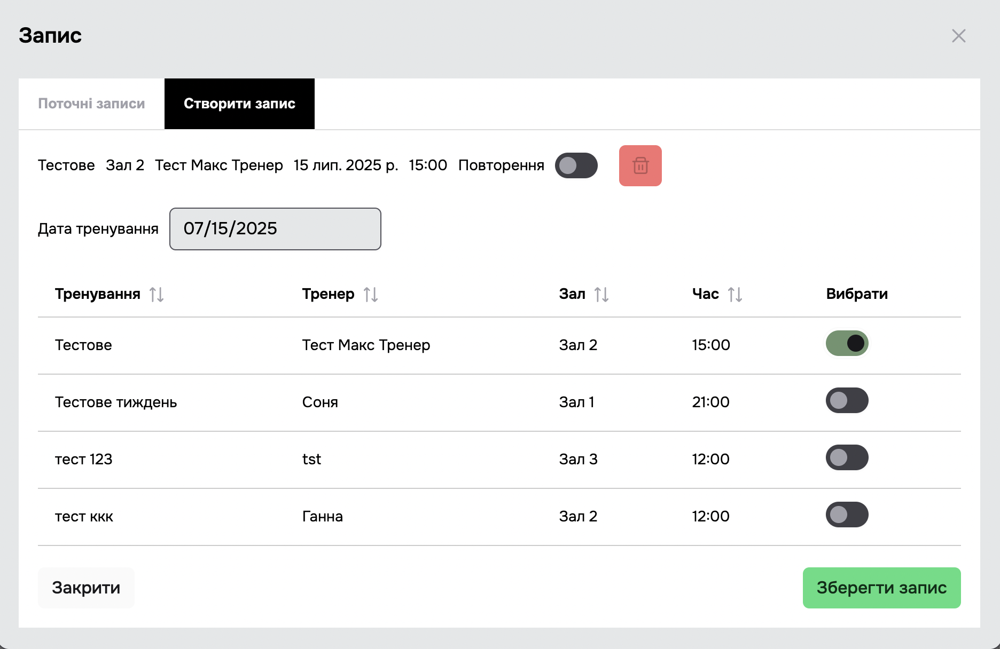

- Вибране тренування зʼявиться у списку зверху.
- Тогл **Повторення** визначає, чи повторювати запис.

### 3.2.8.1 Немає місць

> Якщо тренування переповнене, воно позначається червоним. При наведенні показується підказка _"Немає місць"_.

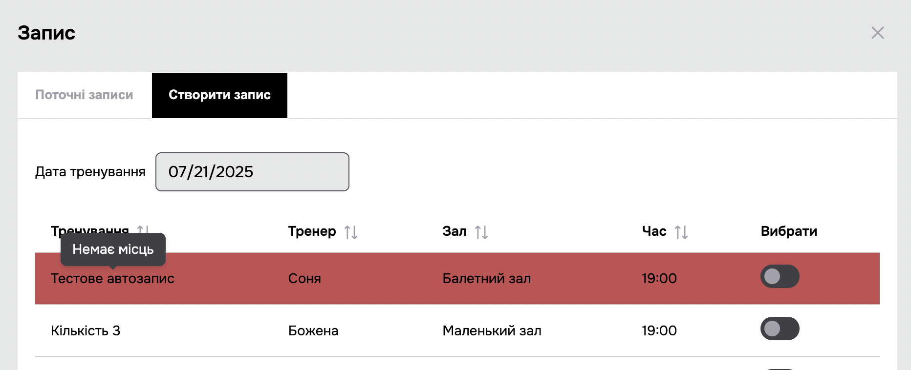

- Адміністратор може все одно записати/зареєструвати клієнта.
- Через Мобільний додаток запис неможливий.

### 3.2.8.2 Відпустка клієнта

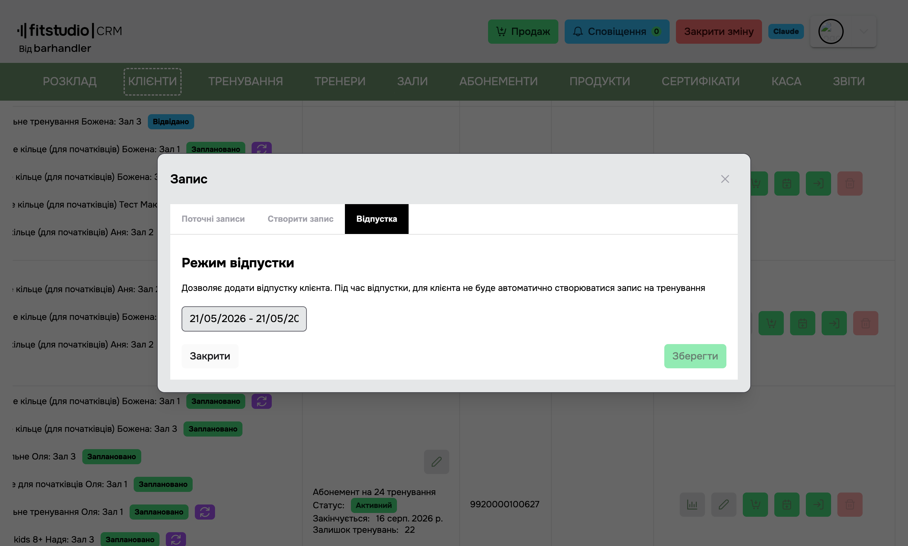

- Дозволяє додати період відпустки клієнта.
- У цей час система не створює записи на тренування.

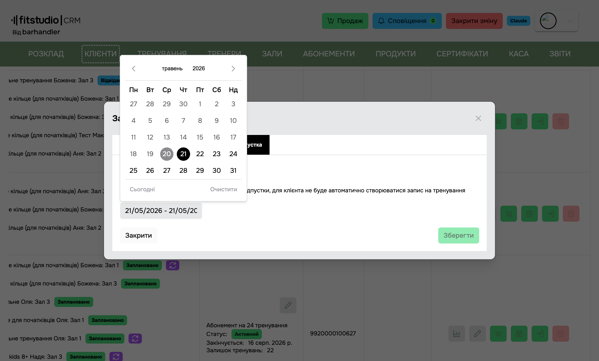

- Відпустка задається через вибір періоду у календарі.
- Її можна видалити.

---

## 3.2.9 Реєстрація

- Якщо клієнт має активні записи, відображаються тренування поточного дня.
- Можна видалити непотрібні.

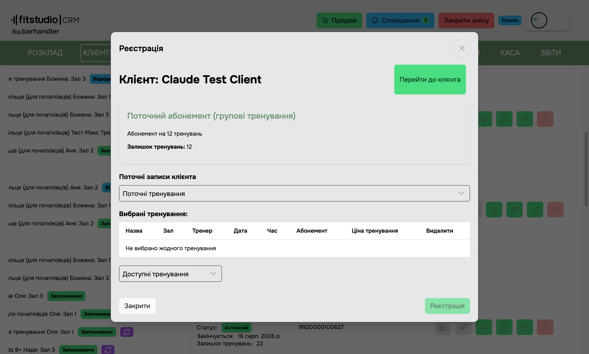

- Якщо є активний абонемент — тоді кнопка **Реєстрація** активна, а сума до сплати = 0.
- Натискання зареєструє клієнта та спише тренування з абонемента.

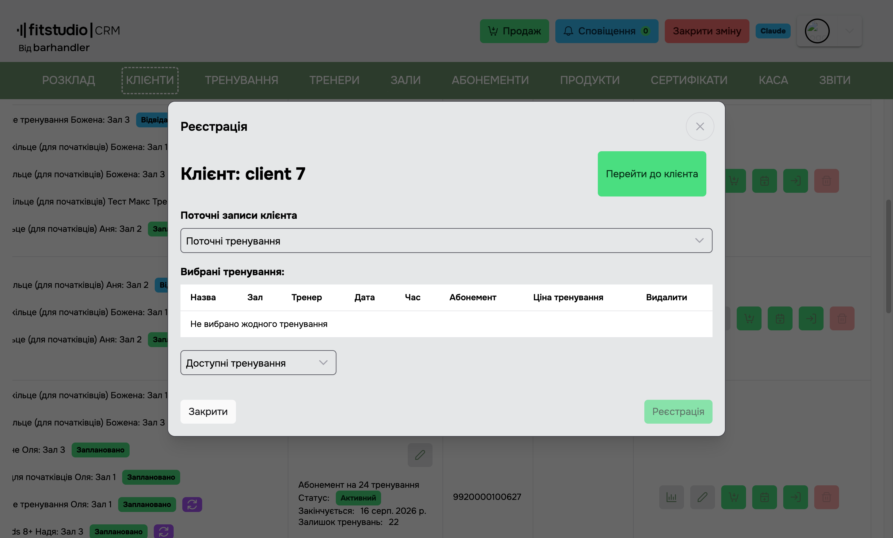

- Якщо абонементів немає — натисніть **Додати абонемент**.
- Можна придбати разове тренування або абонемент.

**`Увага! Неможливо продати більше разових тренувань, ніж потрібно для обраних тренувань.`**

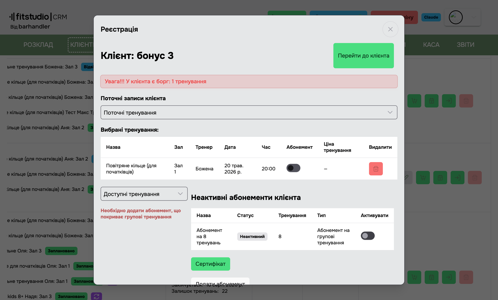

- Тогл **Сплатити пізніше** — для відкладеної оплати.
- У такому випадку клієнт матиме позначку боргу.

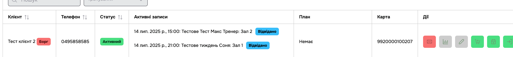

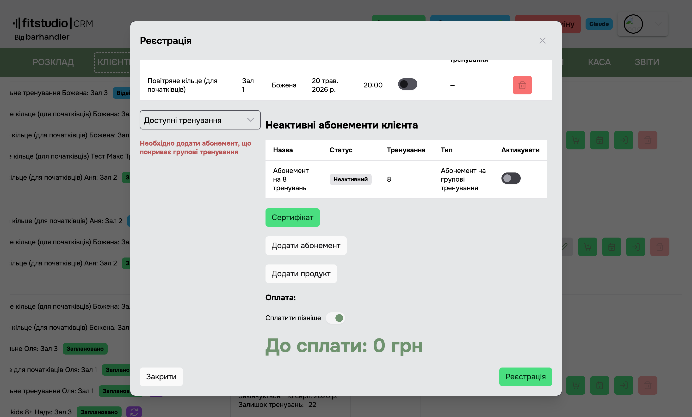

- Якщо клієнт не має записів, можна обрати тренування зі списку **Доступні тренування**.
- Також можна записати навіть при наявності запланованих.

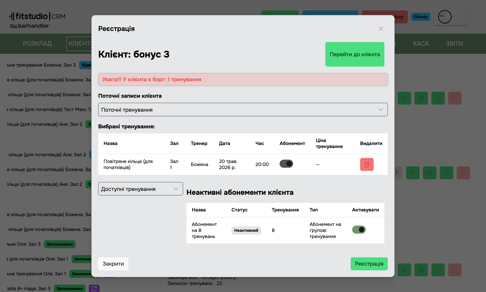

- Якщо є неактивні абонементи — їх можна активувати.
- Якщо є заздалегідь куплені разові тренування — їх можна використати.

**Інформація про абонемент:**

- Якщо абонемент скоро закінчується, система попередить.

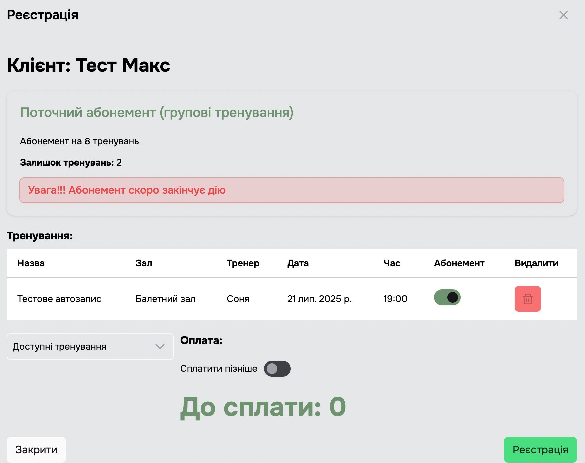

**Додати продукт:** - дозволяє додати продукт до транзакції, навіть якшо реєстрація на тренування проводиться коштом абонементу.

---

## 3.2.10 Видалення клієнта

- Неможливо видалити клієнта зі статусом **Активний**.
- Спочатку потрібно деактивувати, після чого кнопка **Видалити** стане доступною.

---

## 3.2.11 Особовий рахунок

> Кожен клієнт має **Особовий рахунок** (гаманець) — місце для попередніх депозитів, з яких можна оплачувати абонементи / продукти / разові тренування. Залишок видно у рядку клієнта в таблиці і у мобільному додатку клієнта.

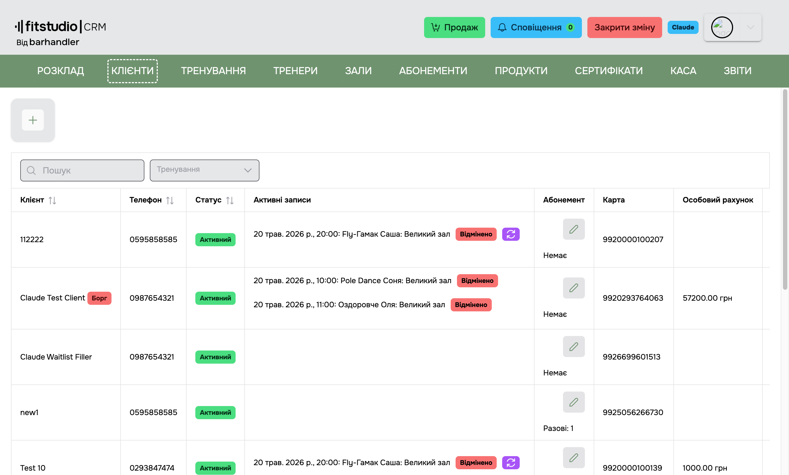

### 3.2.11.1 Поповнення рахунку

> Поповнення робиться через модалку **Продаж**:

1. Натиснути  у рядку клієнта.
2. Обрати **Поповнення рахунку** у фільтрі типів продажу.
3. Ввести суму поповнення, обрати метод оплати (Картка / Готівка / Безготівкова).
4. Натиснути **Оплата**.

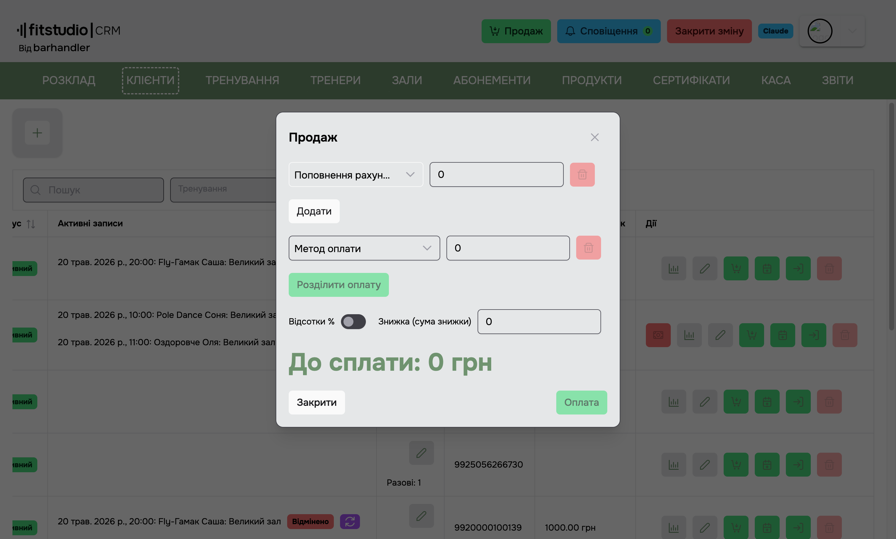

> ℹ️ Поповнення фіскалізується як звичайна транзакція (якщо PRRO активний). Сума зараховується одразу.

### 3.2.11.2 Оплата з рахунку

> При продажі абонементу/продукту або [Реєстрації](#_329-Реєстрація) клієнта у списку методів оплати зʼявляється **"Особовий рахунок — X грн"**, де X — поточний залишок.

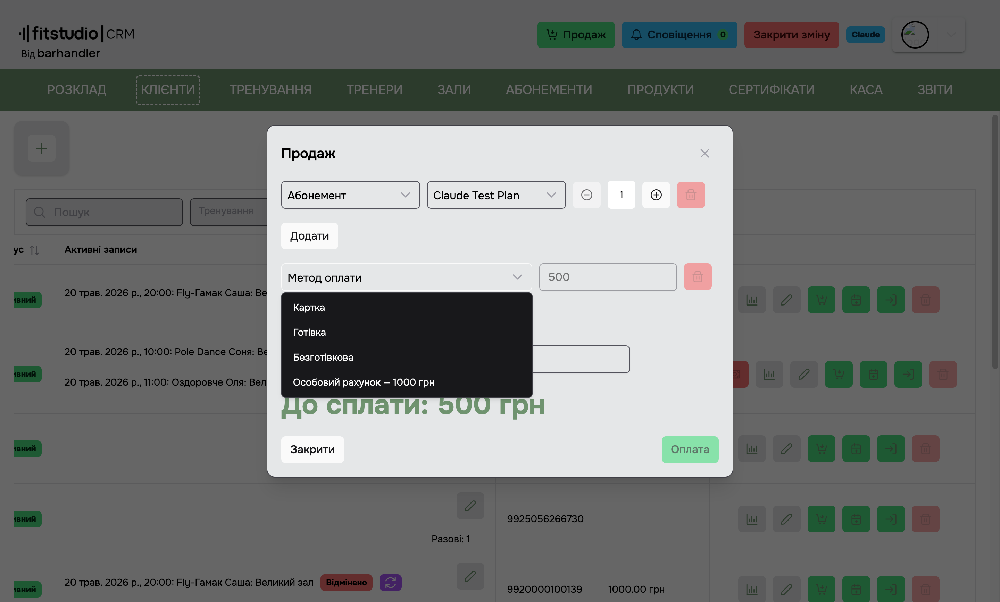

- Обрати **Особовий рахунок** як метод (повна оплата) або вписати суму у часткову оплату через **Розділити оплату** разом з Готівкою/Карткою.
- Якщо обрана сума > залишку — модалка показує помилку, кнопка **Оплата** заблокована.
- Транзакція **не фіскалізується** (бо гроші вже були зафіскалізовані при поповненні).

### 3.2.11.3 Історія рахунку

> Кнопка  відкриває модалку **Історія** з двома вкладками: **Абонементи** і **Особовий рахунок**. На другій вкладці видно всі рухи балансу.

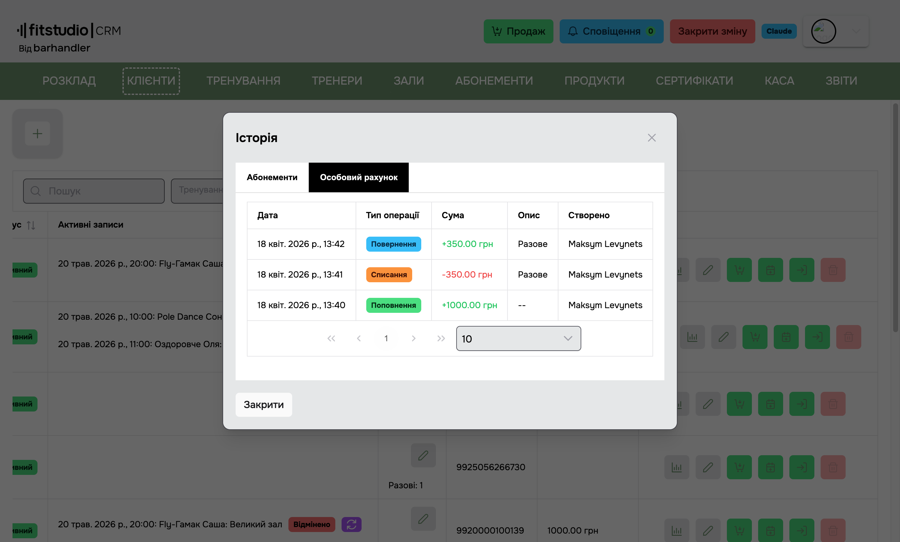

**Колонки історії рахунку:**

| Колонка          | Опис                                                              |
| ---------------- | ----------------------------------------------------------------- |
| **Дата**         | Час операції                                                      |
| **Тип операції** | Поповнення / Списання / Повернення                                |
| **Сума**         | `+N грн` (надходження, зелений) або `−N грн` (списання, червоний) |
| **Опис**         | Назва абонементу/продукту або "--" для поповнення                 |
| **Створено**     | Імʼя адміна що провів операцію                                    |

> 📱 Клієнт бачить свій рахунок і повну історію у мобільному додатку на вкладці **Кабінет → Рахунок**.

---

## 3.2.12 Борг клієнта

> Якщо клієнт зареєструвався на тренування або купив товар через тогл **Сплатити пізніше** — система створює запис боргу. У клієнта зʼявляється бейдж **Борг** поряд з імʼям.

### 3.2.12.1 Іконка боргу

> Клієнти з активним боргом мають **жовтий бейдж "Борг"** поряд з імʼям у рядку таблиці. У колонці **Дії** зʼявляється додаткова кнопка `Debt Payment` (`pi-wallet`).

### 3.2.12.2 Оплата боргу

> Натискання кнопки **Debt Payment** відкриває модалку **Оплата боргу**:

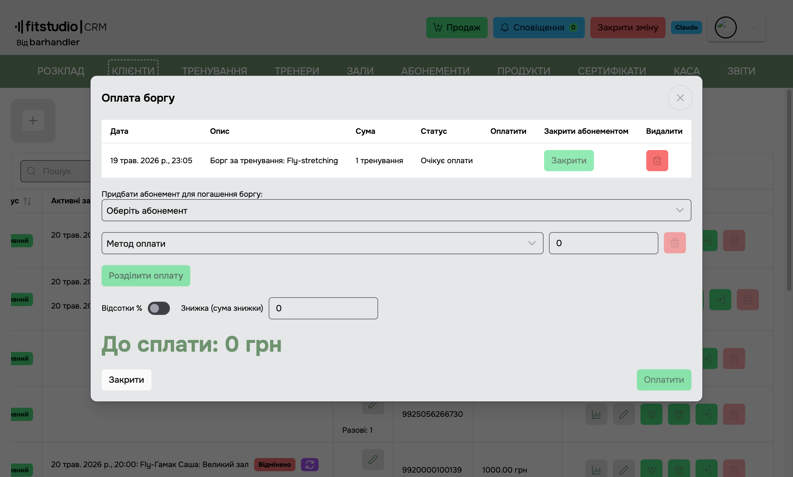

**Структура модалки:**

1. **Таблиця активних боргів** — колонки: Дата • Опис • Сума • Статус • Дії.
   - **Опис** — за що борг (наприклад "Борг за тренування: Fly-stretching").
   - **Сума** — у тренуваннях або у грн (залежно від типу боргу).
   - **Статус** — Очікує оплати / Частково оплачено / Закрито.
   - **Закрити абонементом** — кнопка біля рядка боргу-за-тренування; списує борг з активного абонементу клієнта (без оплати готівкою).
   - **Delete** (🔘) — видалити борг без оплати (тільки SuperAdmin/Admin).

2. **Розділ "Придбати абонемент для погашення боргу"** — продаж абонементу одночасно зі списанням з нього боргу:
   - **Оберіть абонемент** — випадаючий список абонементів студії.
   - **Метод оплати** (Готівка / Картка / Особовий рахунок) + сума.
   - **Розділити оплату** — додає другий метод оплати (split pay).
   - **Знижка (сума знижки)** + тогл **Відсотки %**.
   - **До сплати** — підсумкова сума.
   - **Оплатити** — створює транзакцію продажу абонементу, нараховує його клієнту, і одночасно закриває борг(и).

> ℹ️ Якщо борг — за продукт (не за тренування), він зазвичай оплачується кешем без купівлі абонементу.

---

## 3.2.13 Пошук і фільтр

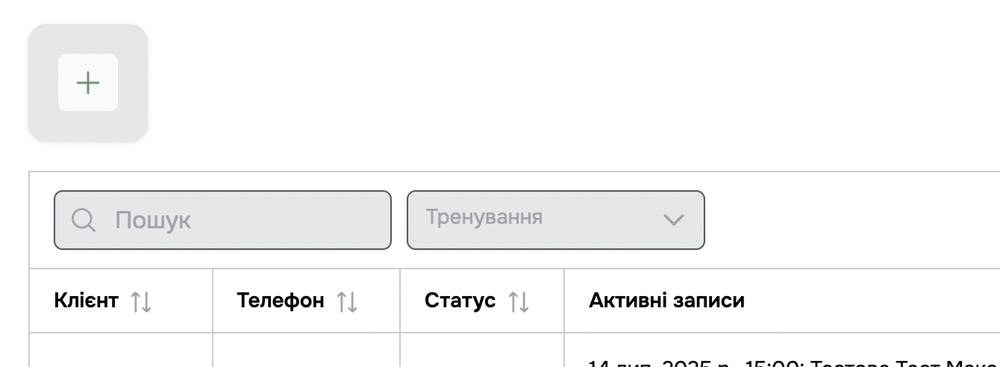

- Пошук доступний за всіма полями: імʼя, телефон, номер картки тощо.
- Є фільтрація клієнтів за тренуванням.

---

<a href="javascript:void(0)" onclick="history.back()">⬅️ Назад</a>

[Повернутися на головну](/)
