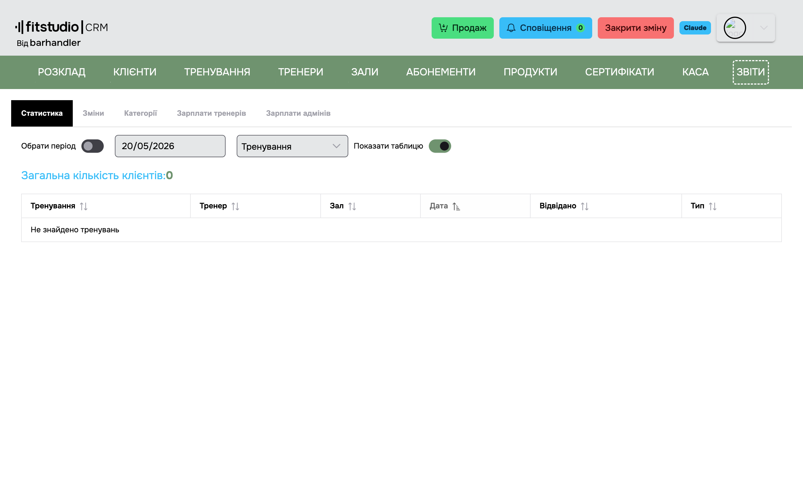
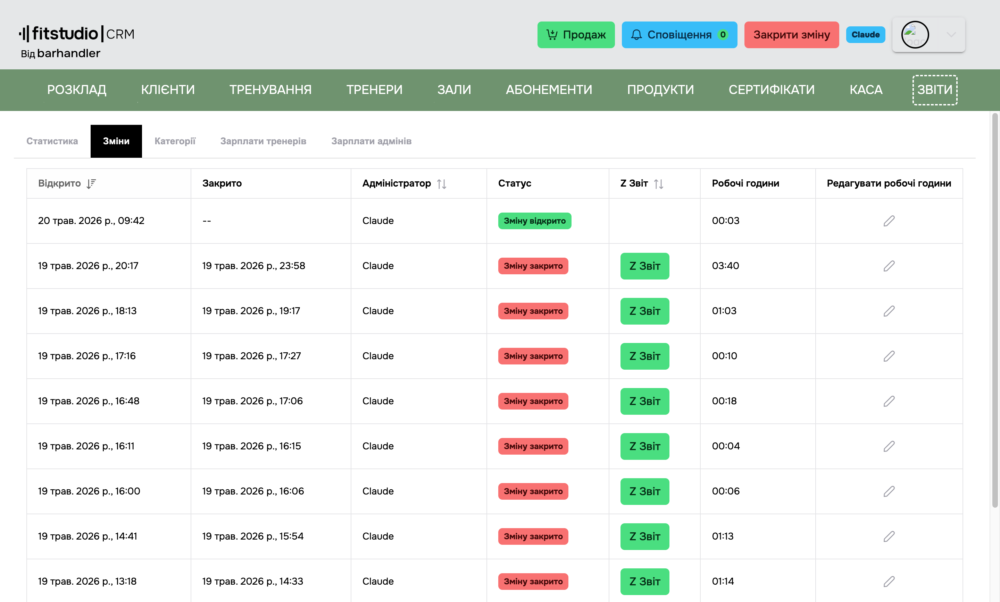
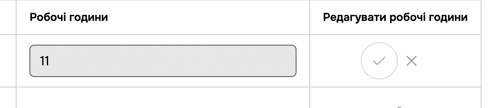
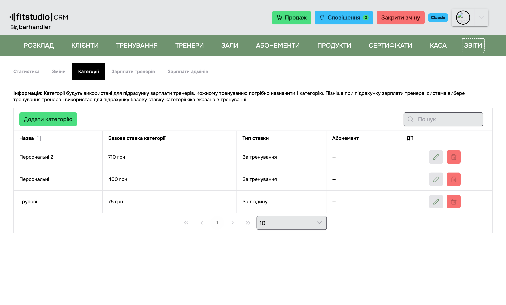
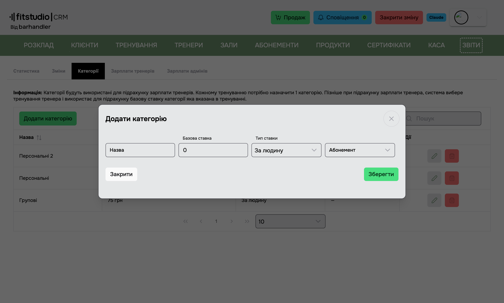
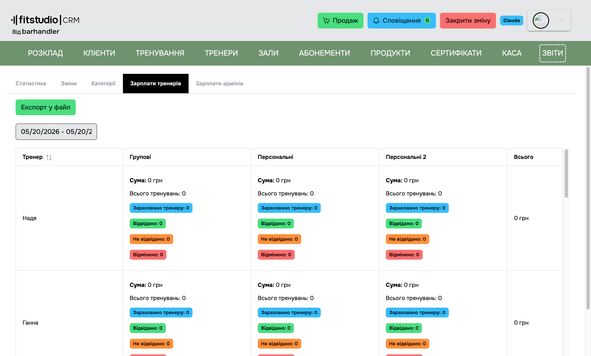
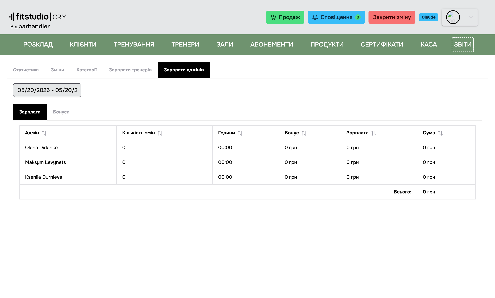

<a href="javascript:void(0)" onclick="history.back()">⬅️ Назад</a>

[Повернутися на головну](/)

# 3.8 Звіти

> Сторінка **Звіти** містить наступні вкладки:

- [Статистика](#_381-Статистика)
- [Зміни](#_382-Зміни)
- [Категорії](#_383-Категорії)
- [Зарплати тренерів](#_384-Зарплати-тренерів)
- [Зарплати адмінів](#_385-Зарплати-адмінів)

> ℹ️ **Транзакції** і **Розширений Звіт** перенесено на сторінку [Каса](/menu/pos) разом з фіскальними звітами і керуванням готівкою.

---

## 3.8.1 Статистика

> Універсальний звіт з різними розрізами. Над таблицею:

- **Date range** — період звіту (за замовчуванням — поточний місяць).
- **Тип звіту** — випадаючий список:
  - **Тренування** — деталізація всіх проведених тренувань (Назва, Тренер, Зал, Дата, Відвідано, Тип).
  - **Абонементи** — продажі і використання абонементів.
  - **Продукти** — продажі товарів.
  - **Клієнти** — статистика по клієнтах (Імʼя, Всього тренувань, Відвідані, Відмінені, Не відвідані, Дата останнього візиту, активність у мобільному додатку).
  - **Розширений** (FC-268) — звіт по проведених тренуваннях з фільтрами:
    - **Категорія** — обмежити конкретною категорією.
    - **Зал** — обмежити одним залом.
    - **Тренер** — обмежити одним тренером.
    - **Тип тренування** — Групове / Персональне / Оренда.

    Колонки: **Категорія**, **Зал**, **Тренер**, **Тип**, **Тренувань** (кількість занять у згруппованому періоді), **Клієнтів** (сумарна кількість відвідувань). Рядки з нульовими значеннями автоматично виключаються.

  - **Потребує уточнення** (FC-110) — список клієнтів у яких **не заповнено поле телефону**. Тільки телефон — інші поля (email, дата народження) у фільтрі не враховуються. Зручно для контролю якості бази, бо без телефону клієнт не отримуватиме пуш-сповіщення з мобільного додатку.

- **Графік** — кнопка переключення між таблицею і візуалізацією (де доречно).

---

## 3.8.2 Зміни

> Список усіх змін за обраний період.

**Колонки:**

- **Відкрито** — дата й час відкриття зміни.
- **Закрито** — дата й час закриття зміни.
- **Адміністратор** — імʼя адміна.
- **Статус** — Відкрито / Закрито.
- **Z звіт** — кнопка перегляду фіскального Z-звіту за зміну.
- **Робочі години** — число у годинах для розрахунку зарплати.
- **Редагування робочих годин** — адмін може редагувати години **тільки своїх закритих** змін.

При натисканні **Редагувати** поле **Робочі години** стає інпутом, у колонці **Дії** зʼявляються кнопки **Зберегти** / **Відмінити**.

> 💡 Якщо потрібно ввести дробове значення (1 год 48 хв) — переведіть у хвилини і поділіть на 60: 108 ÷ 60 = **1,8 год**.

---

## 3.8.3 Категорії

> Категорії використовуються для розрахунку зарплати тренерів і опційно для звʼязки з абонементом. Хоча це не звіт у строгому сенсі — налаштування зручніше тримати поруч із зарплатами.

**Таблиця колонки:**

| Колонка                     | Опис                                                                                                                                                           |
| --------------------------- | -------------------------------------------------------------------------------------------------------------------------------------------------------------- |
| **Назва**                   | Імʼя категорії (наприклад "Групові", "Персональні", "Дитячі").                                                                                                 |
| **Базова ставка категорії** | Сума у грн, що йде у формулу зарплати.                                                                                                                         |
| **Тип ставки**              | **За людину** (`PerPerson`) — рахується кількість клієнтів і множиться на ставку. **За тренування** (`PerWorkout`) — рахується кількість проведених тренувань. |
| **Абонемент**               | Опційний звʼязок з конкретним абонементом (для категорій під персональні плани).                                                                               |
| **Дії**                     | Редагувати / Видалити.                                                                                                                                         |

**Пошук** — поле над таблицею, шукає по назві.

### Додати / Редагувати категорію

> Кнопка **+ Додати категорію** відкриває модалку. Така ж модалка — при натисканні на **Редагувати** у рядку.

**Поля:**

- **Назва** — обовʼязкове.
- **Базова ставка** — обовʼязкове, число у грн.
- **Тип ставки** — **За людину** / **За тренування**.
- **Абонемент** — привʼязка категорії до конкретного абонементу. Поле **опційне для типу "За людину"**, але **обовʼязкове для типу "За тренування"** (позначене зірочкою у формі). Логіка: при PerWorkout зарплата за категорію залежить від конкретного плану клієнта; без абонементу неможливо однозначно порахувати.

> ℹ️ Якщо обрано **За тренування** без абонементу — кнопка **Зберегти** буде неактивна. Спершу створіть або оберіть відповідний абонемент.

---

## 3.8.4 Зарплати тренерів

> Розрахунок зарплати тренерів за обраний період.

**Колонки:**

- **Тренер** — імʼя тренера.
- **Динамічні колонки** — система групує всі тренування періоду за **категоріями**, і кожна категорія стає окремою колонкою. Значення і тип розрахунку беруться **з категорії тренування** ([Категорії](#_383-Категорії)):
  - **За людину** (`PerPerson`) — `сумарна кількість клієнтів × baseRate`.
  - **За тренування** (`PerWorkout`) — `кількість проведених тренувань × baseRate`.
- **Всього** — сума всіх категорій для тренера.

> Внизу таблиці — рядок з **загальною сумою по всіх тренерах**.

**Експорт:** кнопка експорту зарплат у **TXT-файл** (текстовий звіт з розбивкою по тренерах та категоріях). Інших форматів експорту немає.

> ℹ️ Розрахунок враховує налаштування **"Враховувати максимальну к-сть людей при підрахунку зарплат"** ([3.8.4.1](#_3841-Налаштування-зарплат)) — якщо клієнтів на тренуванні більше за `workoutCapacity`, зарахується тільки `workoutCapacity`.

### 3.8.4.1 Налаштування зарплат

Деталі див. у [Налаштування → Функції](/login/settings#функції). Поточні впливаючі параметри:

- **Мінімальна кількість клієнтів** — якщо клієнтів менше, тренеру зарахується мінімум.
- **Враховувати максимальну к-сть людей** — обмежує підрахунок капасіті тренування.
- **Знімати повторний запис після N пропусків** — впливає на історію клієнтів у періоді.

---

## 3.8.5 Зарплати адмінів

**Колонки:**

- **Адміністратор**
- **Кількість змін** — скільки робочих змін відкрив за період.
- **Години** — сумарно відпрацьованих годин (з таблиці [Зміни](#_382-Зміни)).
- **Бонус** — нараховано, якщо у [Налаштуваннях](/login/settings) налаштовані бонуси адмінів.
- **Сума** — `години × погодинна ставка з профілю адміна + бонус`.

> Бонуси налаштовуються у [Налаштування → Функції → Бонуси адміністраторів](/login/settings#бонуси-адміністраторів).

---

<a href="javascript:void(0)" onclick="history.back()">⬅️ Назад</a>

[Повернутися на головну](/)
