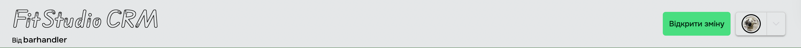
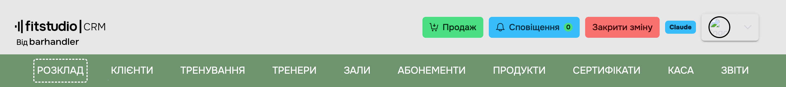
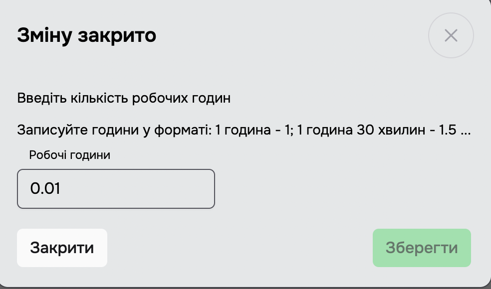
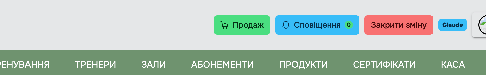
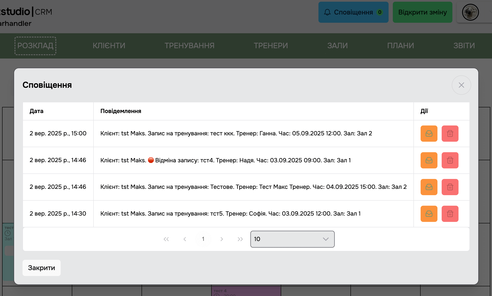

[Повернутися на головну](/)

# 2. Відкриття та закриття зміни

## 2.1 Відкриття зміни

> Кнопка **Відкрити зміну** знаходиться у хедері з правої сторони, коли зміну закрито.

**Обмеження поки зміна закрита:**

- Кнопка **Продаж** прихована (доступна тільки коли зміна відкрита).
- Сканування карток і QR-кодів сертифікатів блокується — система показує модалку «Спочатку відкрийте зміну».
- При спробі відкрити вкладку **Клієнти** з роллю Admin зʼявляється попередження «Ви не відкривали поточну зміну. Деякі дії будуть не доступні» (продовжити можна, але частина дій буде заборонена). **SuperAdmin** і **Manager** працюють з вкладкою без обмежень.

> Зміни використовуються для підрахунку часу роботи та [зарплат адміністраторів](/menu/reports#_385-Зарплати-адмінів).

> Якщо підключено ПРРО, відкриття/закриття зміни синхронізується з ВчасноКасою (на сервері викликається відповідна команда `OpenShift` / `CloseShift`).

---

## 2.2 Закриття зміни

> Кнопка **Закрити зміну** знаходиться у хедері з правої сторони, коли зміну відкрито.

> Після натискання на кнопку **Закрити зміну** буде показано [модальне вікно "Ви впевнені, що хочете продовжити?](../_modals/are-you-sure-modal.md ":include"). Якщо продовжити, зʼявиться модальне вікно **Зміну закрито**.

> На цьому вікні є можливість відредагувати робочі години. Дотримуйтесь інструкцій у модальному вікні.

> Робочий час своєї зміни можна буде змінити пізніше у розділі **Звіти**.

---

## 2.3 Сповіщення

> Сповіщення збираються по подіях у студії: бронювання/відміни клієнтами через Мобільний додаток, автоматичні нагадування системи (нп. *«Клієнт X автоматично знятий з повторного запису: пропущено N тренувань»* — див. [Налаштування → Функції → Знімати повторний запис](/login/settings#функції)), сповіщення про підтвердження ПРРО тощо.
> Лічильник у кнопці показує кількість непрочитаних сповіщень.

> При натисканні відкривається модальне вікно зі списком: дата, текст повідомлення, дії. Кожне сповіщення можна помітити прочитаним / непрочитаним або видалити.

[Повернутися на головну](/)
